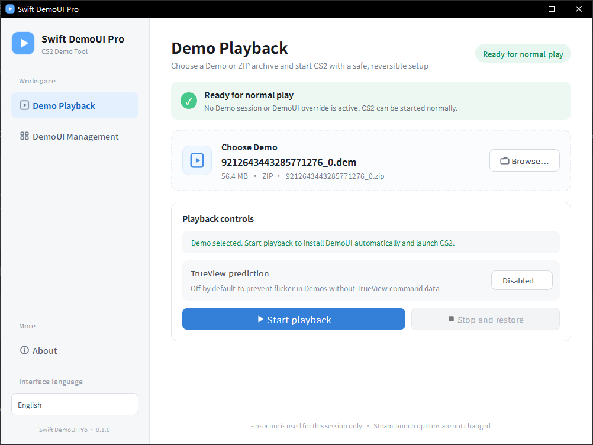
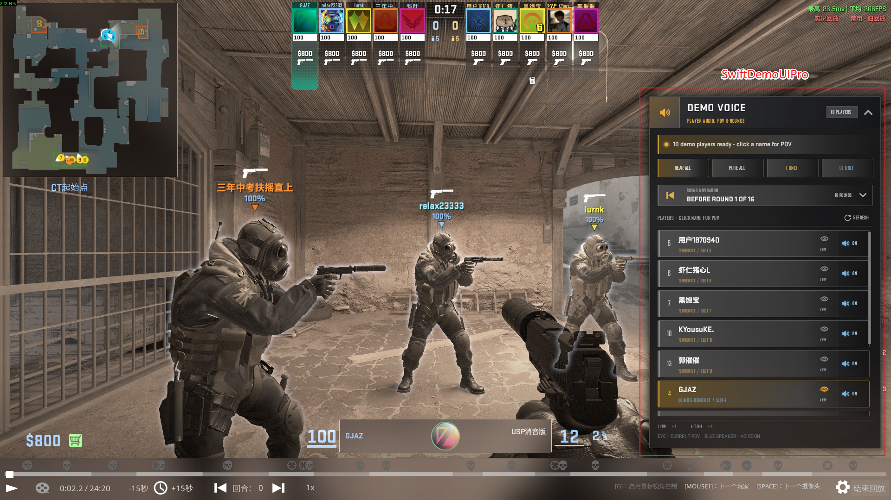

# Swift DemoUI Pro

[English](README.md) | [简体中文](README_CN.md)

[项目官网](https://nicedayzhu.github.io/SwiftDemoUIPro/) · [下载最新版本](https://github.com/nicedayzhu/SwiftDemoUIPro/releases/latest)

Swift DemoUI Pro 是一款非官方的 Counter-Strike 2 Demo 与 HLTV 回放客户端增强工具。Windows 启动器可以直接打开 `.dem` 文件、下载的 `.zip` 压缩包和 FACEIT `.dem.zst` 文件；游戏内面板则在保留 Valve 原生 DemoUI 的同时，加入已录制语音控制、一键切换 POV 和回合导航。

玩家不需要安装 SwiftlyS2、服务器插件、Counter-Strike 2 Workshop Tools DLC 或 Workshop 项目，也不必手动解压 ZIP/Zstandard。运行时需要的语音索引编译器、Zstandard 解码器与 session VPK 写入器已经包含在 Release 包中。

> [!IMPORTANT]
> Demo 回放会使用 `-insecure` 启动 CS2，并由启动器临时向 `gameinfo.gi` 添加 override SearchPath。请勿使用该 CS2 会话进行匹配。观看结束后，请彻底退出 CS2，再在启动器中点击**停止观看并恢复**。

## 界面预览

### Windows 启动器

选择或拖入 Demo、ZIP 或 `.dem.zst`，确认自动检测到的 CS2 安装目录，即可开始回放。启动器会记住界面语言与 TrueView 选项，并在回放结束后移除临时文件。

### 游戏内 DemoUI

新增面板会保留原生时间轴和播放控制，同时提供按玩家控制已录制语音、切换 POV 和直接跳转回合等功能。通过启动器开始回放时，左下角还会显示当前 Demo tick 正在发出已录制语音包的玩家头像与名称。

## 主要功能

- 直接打开 `.dem` 文件、下载的 `.zip` 压缩包和 FACEIT `.dem.zst` 文件。ZIP 只解出所选 Demo；Zstandard 文件在后台流式解压。
- 自动检测 Steam 多个库中的 CS2，仅为本次启动附加 `-insecure`，不会修改 Steam 永久启动项。
- 默认关闭 **TrueView 预测**，避免缺少兼容 TrueView 指令数据的 Demo 出现画面闪烁。
- 支持全部 64 个显示槽位，可收听全部、仅 T、仅 CT 或单独玩家的已录制语音。
- 启动前解析已录制的 `VoiceData`，按 Demo tick 显示正在说话的玩家，无需修改 Demo，也不 patch `client.dll`。
- 每个 Demo 的 Panorama 语音索引和 session VPK 都由内置 Rust 辅助程序生成；玩家无需安装 Valve ResourceCompiler 或 VPKEdit。
- 大型 Demo 的暂存和语音索引会在后台完成，并显示当前准备阶段，不会再冻结启动器窗口。
- 核验目标后，一键切换到存活玩家的第一人称 POV。
- 直接跳转到任意已录制回合的开头。
- 支持英文和简体中文：启动器跟随系统语言，游戏内 DemoUI 自动跟随 CS2 的界面语言。
- 后台检查 GitHub 最新正式 Release，只显示可关闭的小气泡提示。启动器与 DemoUI 可分别决定是否更新，不会自动下载。
- 通过备份、独立临时目录和明确清理流程保证操作可恢复。

## 快速开始

下载并解压 `SwiftDemoUIPro-v<版本号>-win64.zip`，然后：

1. 从解压后的完整目录运行 `SwiftDemoUIPro.exe`，不要单独复制 EXE。
2. 选择或拖入一个 `.dem`、`.zip` 或 `.dem.zst` 文件。
3. 确认自动检测到的 CS2 安装目录。
4. 对大多数下载或第三方 Demo，请保持 **TrueView 预测**关闭；只有确认录像支持 TrueView 时再启用。
5. 点击**开始观看**。启动器会为本次会话安装 DemoUI 并启动 CS2。
6. 观看结束后彻底退出 CS2，回到启动器点击**停止观看并恢复**。

如果启动器意外中断，重新打开即可继续完成待处理的清理。

## 使用游戏内面板

- 使用 CS2 原生 Demo 鼠标模式热键显示光标。
- Demo 开始播放后会自动启用全部 64 个已录制语音槽位，并通过 CS2 的 Panorama 静音接口启用每个已识别的 Demo XUID，不直接访问玩家资料文件。
- 点击存活玩家的名称切换第一人称 POV；当前 POV 会以金色高亮。
- 点击玩家行右侧的音频按钮，只切换该玩家的 Demo 已录制语音槽位；启用时还会通过 `GameStateAPI` 解除该 XUID 当前的原生静音。
- 使用**收听全部 / 全部静音 / 仅 T 方 / 仅 CT 方**快速筛选 Demo 语音；**收听全部**和队伍筛选会解除对应已启用 XUID 当前的原生静音。按钮会随 CS2 语言显示英文或中文。
- 左下角说话状态由当前 Demo tick 驱动，因此跳转、暂停和倍速播放后都能重新计算，不依赖实时麦克风回调。
- 展开**回合导航**，选择回合即可跳转到其起始 tick。
- 面板使用固定位置并向左避让右侧武器槽位；点击整个标题栏区域可展开或收起。

## 常见问题

| 现象 | 处理方法 |
| --- | --- |
| 画面闪烁，或控制台重复出现 `Not enough TrueView command lookahead` | 停止回放，关闭 **TrueView 预测**，再重新启动 Demo。 |
| Windows 提示缺少 `Qt6Gui.dll` | 请运行解压后的 Release 包，不要运行裸编译目录 `launcher\build\Release` 中的 EXE。 |
| 启动器提示仍有待清理内容 | 彻底退出 CS2；必要时重新打开启动器，再点击**停止观看并恢复**。 |
| 部分或全部玩家没有语音 | 启动器只能播放 Demo 中已经录制的语音包，无法恢复从未录制的数据。 |
| 左下角显示玩家正在说话，但听不到声音 | 请使用当前版本重新开始回放。新版会自动启用 Demo 槽位和已识别 XUID；**收听全部**可手动重复这两项操作。 |
| 能听到语音，但左下角没有说话玩家 | 请从完整启动器 Release 包开始回放。单独安装 DemoUI VPK 时只有空索引回退；旧包也不包含 `swift-demo-voice-indexer.exe`。 |

## 兼容性与安全说明

- FACEIT Demo 通常包含已录制语音，但旧版本、损坏或来源不同的 Demo 可能没有完整数据。
- ZIP 条目必须未加密，并使用内置 miniz 支持的压缩方式；解压后的 Demo 最大为 8 GB。
- `.dem.zst` 解压后必须带有 CS2 Demo 的 `PBDEMS2` 文件头；解压后最大为 8 GB，玩家无需安装 `zstd.exe`。
- Valve 可能随时调整原生 DemoUI，届时项目可能需要同步更新。
- 本项目与 Valve 或 FACEIT 没有隶属、授权或背书关系。

## 文档

- [开发者指南](DEVELOPMENT_CN.md)——项目架构、开发环境、构建、测试、翻译、版本与发布。
- [启动器指南](launcher/README_CN.md)——启动器流程、安全边界与打包行为。
- [第三方组件说明](THIRD_PARTY_NOTICES.md)——依赖项和再分发信息。

## 参与贡献

欢迎提交 Issue 和 Pull Request。开始前请阅读[开发者指南](DEVELOPMENT_CN.md)，并运行与修改相关的测试。

## 许可证

项目原创代码使用 [MIT License](LICENSE)。第三方库、字体、游戏资源、名称和商标仍遵循各自条款，详见 [THIRD_PARTY_NOTICES.md](THIRD_PARTY_NOTICES.md)。

## 赞助

如果 Swift DemoUI Pro 对你有帮助，欢迎通过 Ko-fi 支持后续开发：

