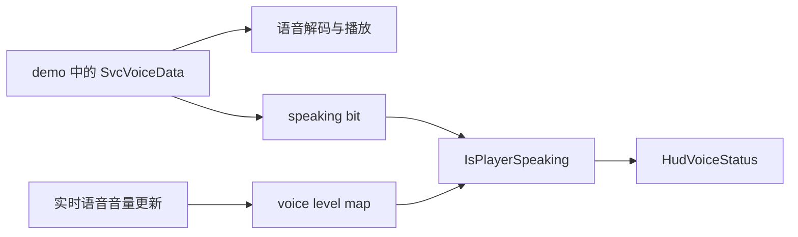

# CS2 Demo 语音说话状态：逆向结论与 SwiftDemoUIPro 实现

> 更新日期：2026-08-08
>
> 状态：已在当前版本 CS2 中实机验证
>
> 目标：播放含语音的 demo 时，显示正在说话玩家的头像、名称和状态
>
> 约束：不注入 DLL、不修改 `client.dll`、不改写源 demo、不覆盖 Valve 原始 VPK

## 1. 最终结论

CS2 播放 demo 时，“能听见语音”和“原生 HUD 判断玩家正在说话”是两条不同的链路。

原生 `HudVoiceStatus` 的核心条件可概括为：

```text
IsPlayerSpeaking(slot) = speaking_bit(slot) && voice_level(slot) > 0
```

demo 中的语音消息足以让游戏解码并播放声音，也会影响 speaking bit；但当前 demo 播放路径不会像实时网络语音那样持续写入 HUD 查询的音量表。因此通常出现：

- demo 语音能够正常播放；
- speaking bit 可能已经置位；
- `voice_level(slot)` 仍为 0；
- 原生左下角说话图标不显示。

仅修改 demo 消息无法可靠补齐这个客户端运行时音量状态。MulNX_CS2 的做法也印证了这一点：它通过修改本地客户端逻辑绕过 demo 分支，而不是通过构造某种特殊 demo 消息恢复原生状态。

SwiftDemoUIPro 最终采用独立方案：

1. 播放前离线解析 demo 中的 `SvcVoiceData`；
2. 生成按玩家槽位组织的说话时间索引；
3. 将索引编译并打包为本次播放专用的 session VPK；
4. 自定义 Panorama HUD 根据当前 demo tick 查询索引；
5. 显示头像、名称、说话图标和死亡状态。

该链路已经在游戏内验证成功。成功画面中，底部诊断信息显示 `4,412 包 / TICK 20,626 / 发言槽位 9`，左下角同步显示了说话玩家的头像、名称、喇叭与死亡标记。

## 2. 原生实现逻辑

### 2.1 数据流



关键点是 `HudVoiceStatus` 同时依赖 speaking bit 和 level map。demo 播放链路能到达左侧两条路径的一部分，却没有完整复现实时语音的 level 更新。

### 2.2 玩家槽位换算

`SvcVoiceData` 中说话者可由以下字段识别：

- 优先读取 `entity`；
- 兼容读取 `client_deprecated + 1`；
- Panorama 与内部位图通常使用零基槽位，因此最终需要统一换算。

实现中必须把 demo 内 speaker、游戏实体索引、记分板槽位和 Panorama UI 槽位区分清楚，避免常见的差一位错误。

### 2.3 `RawAudio` 能做什么

逆向与 POC 表明，`RawAudio` 路径可以影响“正在接收语音”的位图状态，但不能自动给原生 HUD 使用的 level map 写入非零音量。因此它不足以单独恢复图标。

### 2.4 MulNX_CS2 的参考价值

[MulNX_CS2](https://github.com/Co1Swet/MulNX_CS2) 的相关实现会在本地修改客户端对 demo 状态的判断，使语音状态沿另一条客户端路径处理。它证明了问题位于客户端运行时分支，而不是 demo 缺少某个简单标志。

该方案对定位原因很有价值，但不适合 SwiftDemoUIPro：

- 需要修改或挂钩 `client.dll`；
- 对游戏更新敏感；
- 不符合无注入、无 DLL 修改的产品边界。

### 2.5 逆向定位记录

以下地址只用于记录当次分析中的调用关系。CS2 更新后地址会变化，不能作为长期稳定接口。

| 地址 | 分析中的作用 |
| --- | --- |
| `sub_180AEC320` | 查询玩家是否正在说话的关键入口 |
| `sub_180BB7420` | voice level 相关查询 |
| `sub_180BAB2D0` | speaking bit 相关处理 |
| `sub_180AE3EC0` | voice HUD 状态更新路径 |
| `sub_180E49220` | demo/网络消息处理相关路径 |
| `sub_18110D370` | 语音数据处理相关路径 |
| `sub_18110F0C0` | 语音状态传播相关路径 |

## 3. 为什么不继续改写 demo

早期实验尝试过向 demo 注入或改写消息。保留的结论如下：

| 实验 | 结果 | 结论 |
| --- | --- | --- |
| 修改 signon 段 | demo 无法加载或卡住 | signon 消息与容器结构不能随意改写 |
| 在 `DemSpawnGroups` 周边插入数据 | 可加载性不稳定 | 指针、长度与消息边界容易被破坏 |
| 注入未知顶层命令 72 | 播放数秒后“消息无效” | 顶层 demo 命令号不能当作网络消息号使用 |
| 合法封装 `RawAudio` | demo 可正常播放 | 说明容器构造已正确 |
| 观察原生说话图标 | 仍不显示 | 缺失的是客户端 level 状态，不是单个 demo 消息 |

这些实验确认了两点：

1. demo 改写很容易破坏消息边界、长度或 protobuf 上下文；
2. 即使构造出可播放的 `RawAudio`，也只能覆盖原生判断的一部分。

因此不再修改用户源 demo。最终方案只读解析，既避免损坏录像，也避免依赖不稳定的私有消息组合。

## 4. 最终架构


### 4.1 Rust 语音索引器

`tools/voice-indexer` 解析 demo 命令流和嵌套网络消息，提取 `SvcVoiceData` 的 tick 与 speaker，并生成紧凑的脉冲数组。

输出数据示意：

```js
var g_SwiftDemoVoiceData = {
    generated: true,
    holdTicks: 30,
    packetCount: 4412,
    firstTick: 1165,
    lastTick: 84678,
    pulsesBySlot: {
        "9": [20626, 20631, 20637]
    }
};
```

`holdTicks` 用于把离散语音包扩展成短暂的连续说话状态。Panorama 不处理音频，也不做振幅分析，只判断当前 tick 是否落在某个语音脉冲的保持窗口内。

同一个可执行文件还提供：

```text
build-session-vpk <input.dem> <output.vpk>
compile-vjs <input.vjs> <output.vjs_c>
pack-vpk <input.vjs_c> <output.vpk>
```

启动器使用 `build-session-vpk` 一次完成解析、VJS_C 编译和 VPK 打包。后两个命令保留给开发验证和独立诊断。

### 4.2 内置 VJS_C 编译器

Panorama 不能直接可靠加载运行时生成的松散 `.js`，索引仍必须成为 Source 2 编译资源 `.vjs_c`。但普通 CS2 安装只有在用户另外安装并启用 Workshop Tools DLC 后才会包含 `resourcecompiler.exe`，因此它不能作为玩家端运行时依赖。

项目参考 `F:\cs2dev\SkinTools\res\PanoramaCompiler` 中已经验证过的 JavaScript 编译逻辑，把最小编译器移植进 Rust sidecar。动态语音索引使用的资源结构为：

```text
Source 2 resource header: 0x0004000C
resource version:         8
RED2:                     空块
DATA:                     紧凑 UTF-8 JavaScript
```

同一份测试脚本分别经过 Rust 内置编译器和原 `PanoramaCompiler` 后，生成的 `.vjs_c` 长度、SHA-256 和逐字节内容完全一致。Rust 测试还会检查文件长度、版本、块表、相对偏移、16 字节对齐和 DATA 内容。

因此玩家端现在不需要 Workshop Tools DLC 或 `resourcecompiler.exe`，也不再创建临时 `content/csgo_addons`、`game/csgo_addons` 编译目录。

### 4.3 为什么松散目录没有生效

最初将运行时生成的 `.vjs_c` 放进一个优先级更高的松散 SearchPath。文件实际存在且编译成功，但 Panorama 仍加载了静态菜单 VPK 内的同名空索引。

实机结果说明：对于这个同名 Panorama 编译资源，仅提高松散目录优先级不足以稳定覆盖显式 VPK 中的资源。

最终改为生成本次播放专用 VPK：

```text
swift_demo_voice_session.vpk
└── panorama/scripts/hud/swift_demo_voice_data.vjs_c
```

启动配置中的优先级为：

```text
Game csgo/overrides/swift_demo_voice_session.vpk
Game csgo/overrides/swift_demo_menu_override.vpk
Game csgo
```

这样 session VPK 中的真实索引会覆盖静态菜单 VPK 中的空索引。Rust 生成器直接写入一个仅含 `swift_demo_voice_data.vjs_c` 的最小 VPK v1：包括签名、版本、目录树长度、扩展名/路径/文件名字符串、CRC32、`0x7fff` 内嵌数据索引、长度与结束标记，最后紧跟资源数据。实现没有复制、链接或调用 VPKEdit 源码；VPKEditCLI 只用于独立验证生成物的目录树与校验和，运行时不调用也不分发它。

### 4.4 Panorama HUD

`swift_demo_voice.js` 的主要职责是：

- 检查索引对象是否为 `generated: true`；
- 读取当前 demo tick；
- 在每个玩家槽位的有序脉冲数组中查找最近事件；
- 依据 `holdTicks` 计算当前是否发言；
- 从现有 demo/记分板数据映射头像、名称、阵营与存活状态；
- 更新左下角自定义 HUD；
- 在控制面板底部输出诊断状态。

该 HUD 是“原生风格的自定义覆盖层”，不是强行唤醒 Valve 原生 `HudVoiceStatus`。这使实现不依赖私有 DLL 地址，也不受原生 level map 缺失影响。

## 5. 安装、启动与清理

启动器按以下顺序工作：

1. 验证 CS2、demo 和工具路径；
2. 将 demo 复制到受控暂存位置；
3. 调用内置 voice sidecar 解析 demo；
4. sidecar 在内存中生成索引、VJS_C 和 session VPK；
5. 写入仅包含 SwiftDemoUIPro SearchPath 的启动配置；
6. 启动 CS2 并播放暂存 demo。

启动器只管理自己拥有的资源：

- `swift_demo_voice_session.vpk`；
- `swift_demo_menu_override.vpk`；
- SwiftDemoUIPro 专用暂存与配置；
- 旧版本遗留的 `swift_demo_voice_session` 松散目录。

卸载或清理时不会删除用户源 demo，也不会覆盖或修改 CS2 原始 VPK、DLL。

## 6. 验证结果

### 6.1 解析样本

| 样本 | 语音包 | voice bytes | 发言槽位 | tick 范围 | 解析错误 |
| --- | ---: | ---: | ---: | ---: | ---: |
| A | 4,412 | 2,789 | 7 | 1,165–84,678 | 0 |
| B | 38,693 | 23,588 | 9 | 828–92,198 | 0 |

### 6.2 自动化检查

- Rust voice indexer、VJS_C 与 VPK 写入器：6 项测试通过；
- 内置 VJS_C 编译器与原 `PanoramaCompiler` 产物逐字节一致；
- Panorama voice mask：测试通过；
- Launcher：编译通过；
- Launcher CTest：1/1 通过；
- 翻译检查：204 条完成，0 条未完成；
- session VPK：VPKEdit 验证目录与 CRC 通过。

### 6.3 游戏内验证

最终版本已在当前 CS2 中成功加载并显示：

- demo 语音正常播放；
- 语音索引不再显示“未加载，当前为空数据”；
- footer 能显示真实包数、当前 tick 和发言槽位；
- 左下角能显示正在说话玩家的头像、名称和喇叭；
- 玩家死亡时能同步显示死亡标记；
- demo 可正常继续播放，没有“消息无效”或数秒后退出的问题。

## 7. 诊断方法

控制面板底部状态可快速区分三类问题：

| 状态 | 含义 |
| --- | --- |
| `语音索引未加载，当前为空数据` | 静态空索引被加载；检查编译、session VPK 和 SearchPath |
| `语音索引 N 包 / TICK X / 当前无发言` | 索引已加载，但当前 tick 没有活跃语音 |
| `语音索引 N 包 / TICK X / 发言槽位 Y` | 索引、tick 与槽位查询均正常 |

控制台还会输出：

```text
[SwiftDemoVoice] parsed voice index loaded generated=true packets=<count>
```

排查时应先跳到确认有语音的时间段。长静音区显示“当前无发言”是正常行为，不代表加载失败。

## 8. 主要文件

| 路径 | 作用 |
| --- | --- |
| `tools/voice-indexer/` | Rust demo 语音解析、VJS_C 编译与 VPK 打包 |
| `addon/panorama/scripts/hud/swift_demo_voice_data.js` | 静态空索引回退 |
| `addon/panorama/scripts/hud/swift_demo_voice.js` | tick 查询、玩家映射与 HUD 控制 |
| `addon/panorama/layout/hud/huddemocontroller.xml` | 语音 HUD 与诊断区域布局 |
| `addon/panorama/styles/hud/swift_demo_voice.css` | 说话状态样式 |
| `launcher/src/Cs2Manager.cpp` | 解析、编译、打包、挂载与清理主流程 |
| `launcher/build-launcher.ps1` | Windows 构建与打包 |
| `tests/test_demo_voice_mask.js` | Panorama 说话窗口逻辑测试 |

## 9. 维护边界

后续 CS2 更新时优先检查：

1. demo protobuf 或 `SvcVoiceData` 字段是否变化；
2. 当前 tick 的 Panorama 接口是否变化；
3. Source 2 `vjs` Version 4 资源头、块表或 Panorama 加载格式是否变化；
4. SearchPath 对显式 VPK 的加载顺序是否变化；
5. 玩家槽位、实体索引与记分板映射是否变化。

不应将 IDA 中的函数地址做成运行时依赖。地址仅用于解释原生逻辑，产品实现应继续保持“离线解析 + 官方资源编译 + session VPK + Panorama HUD”的无注入架构。

## 10. 最终判断

“仅修改 demo，恢复当前 CS2 原生说话图标”在已验证的消息模型下不可行：demo 可以携带并播放语音，却不能表达原生 HUD 所需的完整客户端实时音量状态。

SwiftDemoUIPro 的现有实现绕开了这一缺口，同时保留了用户真正需要的体验：播放 demo 时能准确看到谁正在说话。它不修改 DLL、不破坏 demo，且诊断、部署和清理均可控，是目前更稳定、可维护的方案。
